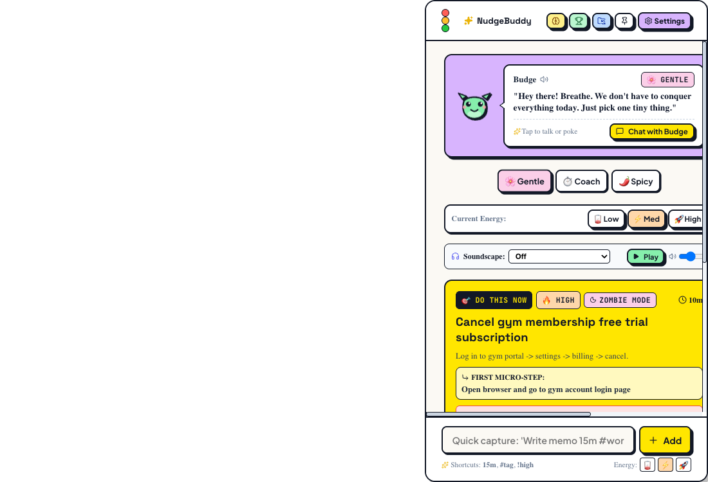

<div align="center">

# 👾 NudgeBuddy

### **Humanized AI Focus & Accountability Companion**
*Built for ADHD minds, procrastinators, and deep-work sprinters.*

[](https://www.typescriptlang.org/)
[](https://react.dev/)
[](https://vitejs.dev/)
[](https://www.electronjs.org/)
[](https://www.docker.com/)
[](https://vitest.dev/)
[](LICENSE)

<br />



<br />

[✨ Features](#-key-features) •
[🚀 Quickstart](#-quickstart) •
[🖥️ Desktop Companion](#️-native-macos-desktop-companion) •
[🌐 Chrome Extension](#-chrome-side-panel-extension) •
[🐳 Docker](#-docker-deployment) •
[🎨 Design Branches](#-design-branches)

</div>

---

## 💡 The Problem NudgeBuddy Solves

Traditional task managers and to-do lists are **overwhelming to-do graveyards** for ADHD brains and procrastinators:
* ❌ Overcrowded lists trigger executive dysfunction and decision paralysis.
* ❌ Timers without personality feel cold, robotic, and easy to ignore.
* ❌ Avoided tasks linger forever without actionable breakdown.

**NudgeBuddy fixes this by introducing an emotionally resonant, local-first AI companion** that lives on your desktop, provides gentle or spicy accountability, detects when you are stuck, and guides you one micro-step at a time.

---

## ✨ Key Features

### 👾 1. Interactive AI Mascot ("Budge")
* **3 Expressive Personalities**:
  * 🌸 **Gentle**: Warm, validating, and calming encouragement.
  * ⏱️ **Direct**: Concise, clear, and goal-oriented momentum.
  * 🌶️ **Spicy**: Playful tough-love banter that calls out doom-scrolling and task avoidance.
* **Reactive Mood Engine**: Reacts dynamically to your focus streak, timer pauses, poke clicks, and completed sprints.
* **100% Offline Local Intelligence**: 0ms latency local prompt engine with zero API keys required, plus optional live Gemini 1.5 streaming integration.

### ⚡ 2. 25-Minute Flow Sprint & Focus Soundscapes
* **Single-Task Hero Card**: Prominently highlights **"Do This Now"** to eliminate decision fatigue.
* **Integrated Ambient Soundscapes**:
  * 🌊 **40Hz Binaural Beats** (Gamma brainwave focus entrainment)
  * 🌧️ **Cozy Rain on Window**
  * ☕ **Lo-Fi Coffeehouse Ambience**
* **Dopamine Badges**: 8-bit retro sound effects, celebratory confetti fanfare, and streak trackers.

### 🎯 3. Energy-Aware Task Prioritization
* Filter and auto-rank your tasks based on your current biological energy state:
  * 🪫 **Low Energy (Zombie)**: Quick, low-friction micro-wins (5–15 mins).
  * ⚡ **Balanced (Normal)**: Standard productive workflow.
  * 🚀 **High Energy (Beast Mode)**: Heavy deep-work and complex challenges.

### 🧠 4. Brain Dump NLP Parser
* Type or paste unformatted, chaotic stream-of-consciousness thoughts:
  > *"need to email Sarah about the budget tomorrow morning #urgent and finish the pitch deck 45m high energy"*
* **Instant Natural Language Extraction**: Automatically parses task titles, energy levels, estimated minutes, and urgency tags.

### 🛡️ 5. Proactive Avoidance Detection & Micro-Steps
* Detects when you have repeatedly postponed or avoided a high-priority task.
* Intervenes with a supportive modal that breaks overwhelming blockers into **3 bite-sized 2-minute micro-actions**.

### 📌 6. Flexible Desktop Modes
* 📌 **Pinned Open (Static)**: Stays permanently visible on your desktop beside your workspace.
* 🚀 **Bottom Dock (Floating Pill)**: Collapses into an ultra-sleek **150px floating pill** in the bottom corner that expands **UPWARD** on hover.
* 🪄 **Edge Drawer**: Tucks discreetly into the right bezel of your Mac monitor.
* 👁️ **Ghost Dim**: Dims to 80% translucent when you work in other apps.

### 📂 7. Local-First & Obsidian / Calendar Sync
* **100% Offline-First**: All state saved locally via localStorage / local storage engine.
* **Obsidian / Logseq Sync**: 1-click Markdown export formatted with frontmatter and checkboxes.
* **Apple Calendar / Google Calendar Export**: Generates `.ics` focus schedule calendar blocks.
* **CSV & Full JSON Backups**: Easy data portability and instant restoration.

---

## 🚀 Quickstart

### Prerequisites
* [Node.js](https://nodejs.org/) (v18 or higher)
* [npm](https://www.npmjs.com/) (v9 or higher)

### 1. Clone & Install
```bash
git clone https://github.com/janiceho96/nudgebuddy.git
cd nudgebuddy
npm install
```

### 2. Run Development Server
```bash
npm run dev
```
Open **`http://localhost:5173`** in your browser.

### 3. Run Tests
```bash
npm test
```
*Runs all 35 unit & state machine tests with Vitest.*

---

## 🖥️ Native macOS Desktop Companion

Run NudgeBuddy as a **floating, frameless, transparent macOS desktop app**:

```bash
# Build the native Mac app bundle
./scripts/build-macos-app.sh

# Launch the desktop app
open /Users/$(whoami)/Desktop/NudgeBuddy.app
```

* **Global Shortcut**: Press **`⌥ + Space`** (`Option + Space`) anywhere on your Mac to toggle / hide / show NudgeBuddy!
* **Always on Top**: Floats cleanly above your IDE, browser, and design tools.

---

## 🌐 Chrome Side Panel Extension

Use NudgeBuddy natively inside Google Chrome's right side panel with **zero macOS Gatekeeper restrictions**:

```bash
# Build the Chrome extension bundle
./scripts/build-chrome-extension.sh
```

1. Open **`chrome://extensions`** in Google Chrome.
2. Enable **Developer mode** (top-right toggle).
3. Click **Load unpacked** (top-left) and select the generated **`dist-chrome-extension`** directory.
4. Open the Chrome Side Panel and select **NudgeBuddy**!

---

## 🐳 Docker Deployment

Run NudgeBuddy in an ultra-lightweight **Alpine Nginx container (~25MB)** on any server or OS:

```bash
# 1-Command Startup
docker compose up -d
```
Open **`http://localhost:3000`** in your browser.

Or build and run manually:
```bash
docker build -t nudgebuddy .
docker run -d -p 3000:80 --name nudgebuddy-container nudgebuddy
```

---

## 🎨 Design Branches

NudgeBuddy features multiple specialized design themes tailored for different personality archetypes:

| Branch | Aesthetic / Archetype | Mascot | Description |
| :--- | :--- | :--- | :--- |
| **`main`** | **Neo-Brutalist Pop (ENTP / General)** | `Budge` (Pixel Alien 👾) | Bold vibrant accents, high-contrast borders, dynamic dopamine badges. |
| **`feature/infj-minimalist-sanctuary`** | **Alabaster Zen (INFJ / Minimalist)** | `Sol` (Celestial Guide 🕊️) | 1px hairline borders, muted mist palette, simplified single-card North Star timer. |
| **`feature/cozy-zen-matcha`** | **Japanese Matcha Cafe (Cozy Zen)** | `Matcha Spirit` (Tea Spirit 🍵) | Washi paper textures, warm earth tones, tranquil tea garden soundscapes. |

Switch branches easily:
```bash
git checkout feature/infj-minimalist-sanctuary
# or
git checkout feature/cozy-zen-matcha
```

---

## 🏗️ Project Architecture

```
nudgebuddy/
├── src/
│   ├── components/
│   │   ├── Agent/           # Mascot avatar, dialogue bubbles, personality selectors
│   │   ├── Focus/           # 25m Pomodoro timer, ambient soundscapes, micro-actions
│   │   ├── Tasks/           # Intentions checklist, task drawer, quick capture
│   │   ├── Layout/          # Frameless Mac header, mode cyclers, dock pills
│   │   ├── BrainDump/       # NLP brain dump extraction modal
│   │   ├── Stats/           # Dopamine badges, daily focus recaps
│   │   └── Settings/        # Voice, sound, energy, and API key preferences
│   ├── core/
│   │   ├── stateMachine.ts  # Central predictable state reducer & event types
│   │   ├── agentDialogueEngine.ts # Contextual personality speech generator
│   │   ├── priorityEngine.ts      # "Do This Now" energy-aware ranking algorithm
│   │   ├── avoidanceDetector.ts   # Procrastination detection heuristics
│   │   ├── audioEngine.ts         # 8-bit retro SFX & binaural audio synthesis
│   │   ├── brainDumpParser.ts     # Stream-of-consciousness NLP parser
│   │   └── storage.ts             # Local-first persistence manager
│   ├── types/               # TypeScript interfaces & domain types
│   ├── App.tsx              # Root dashboard view
│   └── App.css              # Neo-brutalist & responsive CSS system
├── electron-main.cjs        # Native macOS frameless window manager
├── scripts/                 # Automated build & packaging scripts
├── dist-chrome-extension/   # Manifest V3 Chrome Side Panel bundle
├── Dockerfile               # Multi-stage Docker build configuration
├── docker-compose.yml       # 1-command Docker service definition
└── tests/                   # 35 Unit tests (Vitest)
```

---

## 🧪 Testing

NudgeBuddy includes automated test coverage for core business logic and algorithms:

```bash
npm test
```

```
 ✓ tests/agentDialogueEngine.test.ts (5 tests)
 ✓ tests/avoidanceDetector.test.ts (4 tests)
 ✓ tests/brainDumpParser.test.ts (3 tests)
 ✓ tests/calendarSync.test.ts (2 tests)
 ✓ tests/cli.test.ts (2 tests)
 ✓ tests/markdownSync.test.ts (2 tests)
 ✓ tests/priorityEngine.test.ts (6 tests)
 ✓ tests/stateMachine.test.ts (8 tests)
 ✓ tests/statsEngine.test.ts (3 tests)

 Test Files  9 passed (9)
      Tests  35 passed (35)
```

---

## 📄 License

MIT © [MacJanice](https://github.com/janiceho96)
